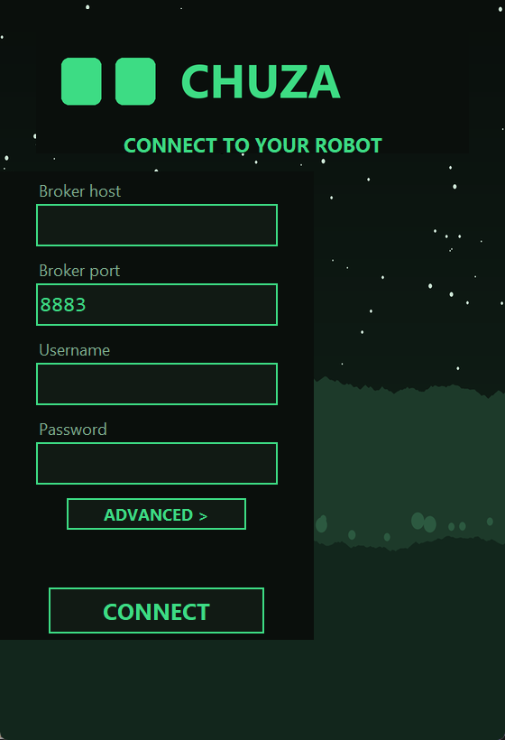
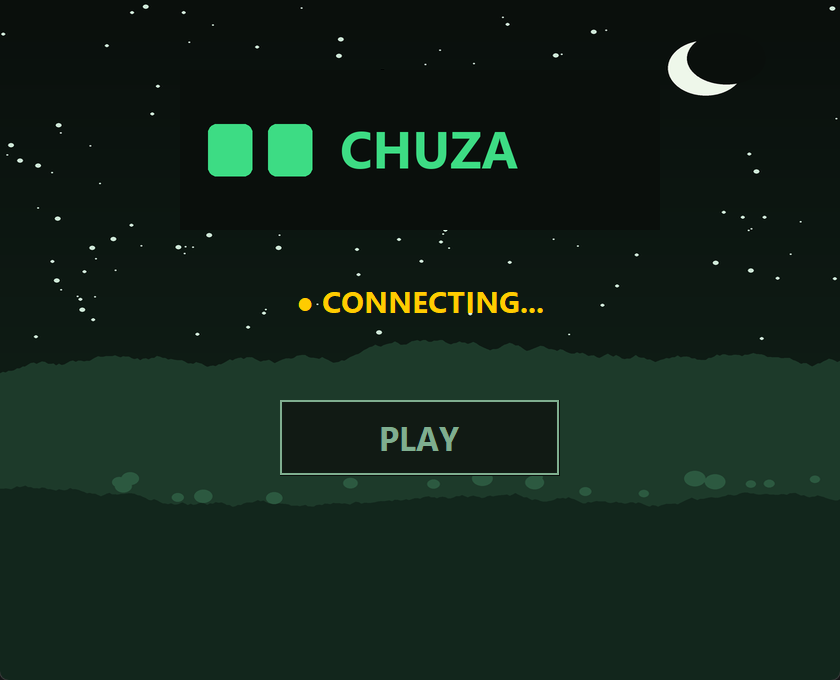
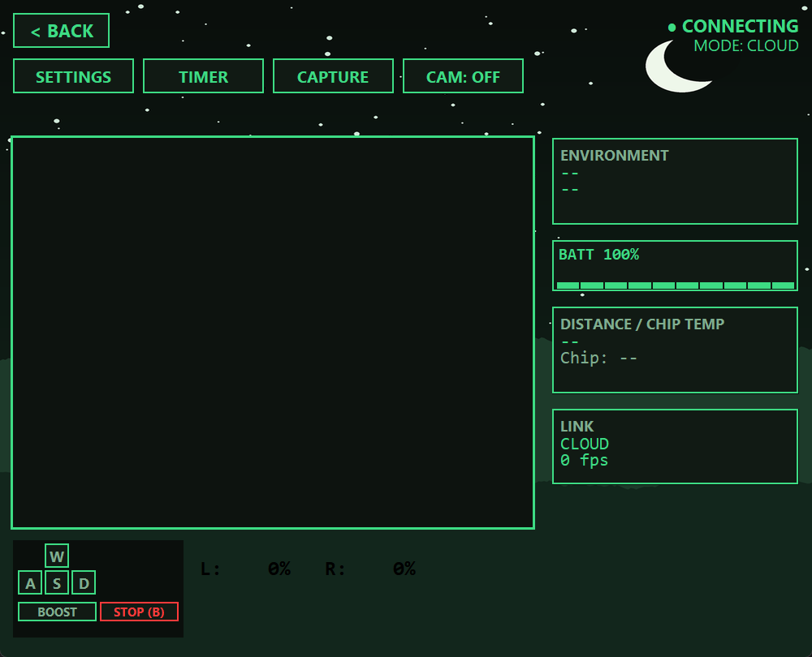
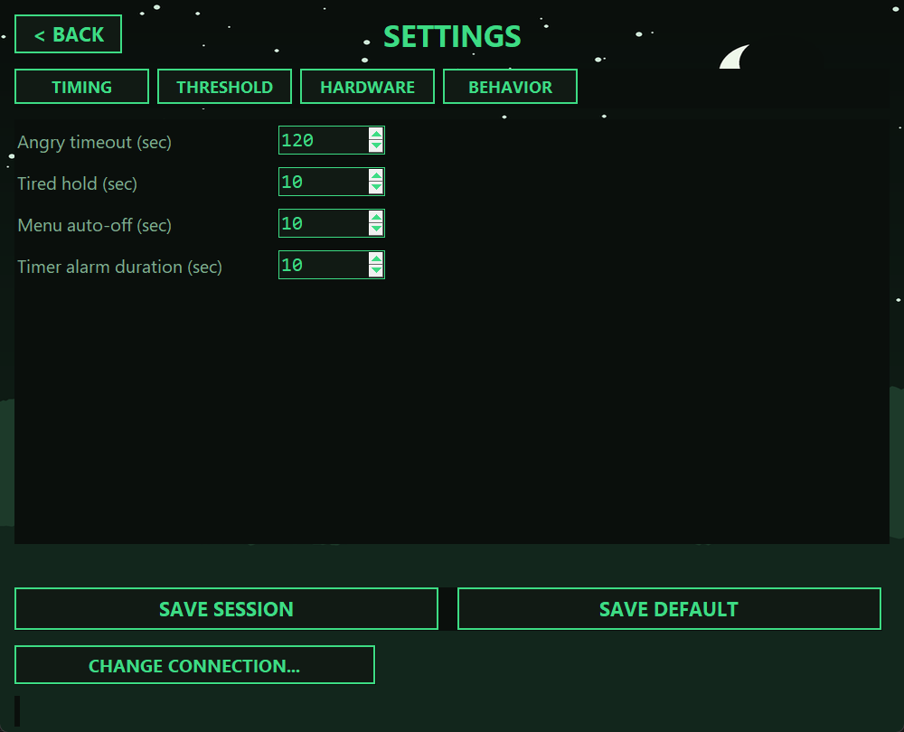
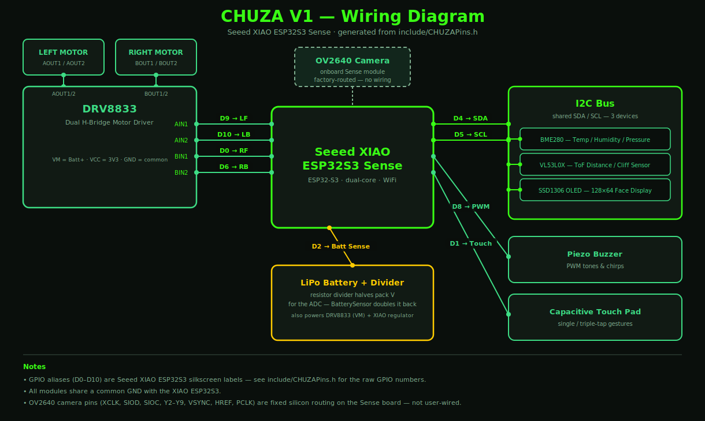

<p align="center">
  
</p>

<h3 align="center">An autonomous, internet-connected desktop companion robot</h3>

<p align="center">
  Built on an ESP32-S3 — animated OLED face, capacitive-touch reflexes, environmental sensing,<br>
  a globally-accessible FPV feed, and a custom desktop control app.
</p>

<p align="center">
  
  
  
  
</p>

---

CHUZA is more than an RC car — it's an autonomous desktop "pet" that wanders, reacts to petting, watches for the edge of the desk, and streams a live first-person video feed from anywhere in the world. This repo holds the full stack: the ESP32-S3 firmware, the wiring, and the companion desktop app used to drive it.

## Contents

- [Features](#features)
- [CHUZA Control (desktop app)](#chuza-control-desktop-app)
- [Architecture](#architecture)
- [Hardware & wiring](#hardware--wiring)
- [Tech stack](#tech-stack)
- [Getting started](#getting-started)
- [Repo structure](#repo-structure)
- [How it was built](#how-it-was-built)
- [License](#license)

## Features

- **Strictly non-blocking firmware.** `delay()` is banned throughout — a cooperative [`Scheduler`](lib/Scheduler/Scheduler.h) ticks every subsystem off `millis()`, so a slow network call can never make CHUZA miss a cliff edge.
- **Dual-core FreeRTOS split.** Core 0 owns WiFi, MQTT, and camera streaming; Core 1 owns motors, sensors, touch, and the display — heavy networking can never stall real-time control.
- **Animated RoboEyes-style face.** A mood engine on the SSD1306 OLED reacts to petting, battery level, and menu state (`lib/CHUZAFace`).
- **Capacitive touch gestures.** Single tap changes expression, triple tap opens the on-device menu — timing-based, debounced, tuned for the ESP32-S3's inverted touch polarity (`lib/CHUZATouch`).
- **Autonomous "Wander Mode".** Three intensities (OFF / SOFT / NORMAL) of idle-time exploration, instantly overridden by obstacle/cliff reflexes (`lib/CHUZAWander`).
- **Reflex safety.** Continuous VL53L0X polling for both forward obstacles and desk-edge "cliff" detection, clamped straight into the motor driver regardless of what's currently commanding it.
- **Dual connectivity, automatic failover.** A cloud path (TLS MQTT via HiveMQ) works from anywhere; the app auto-detects when it's on the same network as the robot and switches to a LAN-direct UDP + local MJPEG path for far lower latency (`lib/MqttLink`, `lib/CHUZALocalLink`).
- **Live FPV streaming.** The onboard OV2640 streams MJPEG over whichever transport is active, with a chip-thermal safety cutoff.
- **Persisted settings.** Every tunable (thresholds, PWM range, timers, per-subsystem enable/disable) lives in one `RobotSettings` model, editable from the app and saved to NVS.

## CHUZA Control (desktop app)

A Tkinter desktop app with a hand-rolled pixel-art "dark jungle" HUD — live telemetry, keyboard driving, and an in-app settings editor, all built directly on top of the same MQTT/UDP protocol the firmware speaks.

<table>
<tr>
<td align="center" width="50%"><br><sub>Connect screen — broker credentials, reused for in-app "Change Connection"</sub></td>
<td align="center" width="50%"><br><sub>Home — live connection status, PLAY to enter driving mode</sub></td>
</tr>
<tr>
<td align="center" width="50%"><br><sub>Control — camera viewport, D-pad readout, HUD telemetry sidebar</sub></td>
<td align="center" width="50%"><br><sub>Settings — mirrors <code>RobotSettings</code> field-for-field, session or default save</sub></td>
</tr>
</table>

Driving uses **W/A/S/D** (Space to boost, B to brake), with gentle arc-turns while moving and pivot-turns while stationary. **CAPTURE** saves the current frame to disk; **TIMER** schedules an OLED alarm on the robot itself.

## Architecture

| Module | Responsibility |
|---|---|
| [`CHUZAWheels`](lib/CHUZAWheels) | DRV8833 motor driver — ramped speed targets, cliff-block clamp, per-side trim |
| [`CHUZAFace`](lib/CHUZAFace) | RoboEyes OLED face, mood engine, on-device menu state machine |
| [`CHUZATouch`](lib/CHUZATouch) | Debounced capacitive touch, single/double/triple-tap counting |
| [`CHUZABuzzer`](lib/CHUZABuzzer) | Non-blocking piezo melody/beep sequencer |
| [`CHUZAWander`](lib/CHUZAWander) | Autonomous idle-time driving policy (OFF/SOFT/NORMAL) |
| [`CHUZAEnvSense`](lib/CHUZAEnvSense) | BME280 temperature / humidity / pressure, cached reads |
| [`CHUZADistance`](lib/CHUZADistance) | VL53L0X time-of-flight ranging for obstacles + cliff edge |
| [`CHUZABattery`](lib/CHUZABattery) | Resistor-divider ADC read → 0–100% estimate |
| [`CHUZACamera`](lib/CHUZACamera) | OV2640 capture, enable/disable, thermal safety cutoff |
| [`CHUZASettings`](lib/CHUZASettings) | Single source of truth for every tunable, NVS persistence |
| [`MqttLink`](lib/MqttLink) | TLS MQTT over WiFi — two independent connections (commands, telemetry/camera) on Core 0 |
| [`CHUZALocalLink`](lib/CHUZALocalLink) | LAN-direct UDP commands + local MJPEG stream, always listening |
| [`CHUZACommand`](lib/CHUZACommand) | Single JSON command dispatcher shared by both MQTT and LAN-direct paths |
| [`Scheduler`](lib/Scheduler) | Minimal cooperative task scheduler driving the whole `loop()` |

**Command flow:** the app always tries LAN-direct UDP first; if that probe fails (different network, robot out of range), it transparently falls back to publishing on `robot/commands` over MQTT. Both paths route through the same `dispatchRobotCommand()`, so the robot behaves identically either way. Settings and timer commands are cloud-only, since the app's MQTT connection stays up regardless of link mode.

## Hardware & wiring



| Component | Role |
|---|---|
| Seeed XIAO ESP32S3 Sense | Main controller — dual-core ESP32-S3, WiFi, onboard OV2640 camera |
| DRV8833 | Dual H-bridge driver for the two drive motors |
| VL53L0X | Time-of-flight sensor — forward obstacles + downward cliff edge |
| BME280 | Temperature / humidity / pressure |
| SSD1306 (128×64, I2C) | Animated face / menu / clock display |
| Piezo buzzer | Non-blocking chirps and status tones |
| Capacitive touch pad | Petting input for the mood engine + menu access |
| LiPo cell + resistor divider | Power, with a halved-voltage tap into an ADC pin for battery %/voltage |

Pin assignments are centralized in [`include/CHUZAPins.h`](include/CHUZAPins.h) — nothing else in the codebase hardcodes a GPIO number. Two 3D-printed wheels (SolidWorks source + STL) live under [`Wheels/`](Wheels).

## Tech stack

**Firmware** — C++ / Arduino framework via PlatformIO, targeting `seeed_xiao_esp32s3`:
Adafruit BME280 / VL53L0X / SSD1306 / GFX / BusIO, PubSubClient, ArduinoJson.

**Desktop app** (`CHUZAControls/`) — Python 3, Tkinter for UI, `paho-mqtt` for the cloud link, Pillow for image handling, PyInstaller for standalone Windows builds.

## Getting started

### Firmware

1. Open the repo in [PlatformIO](https://platformio.org/) (VS Code extension or CLI).
2. Fill in your own values in [`include/Secrets.h`](include/Secrets.h) — WiFi credentials and a [HiveMQ Cloud](https://www.hivemq.com/mqtt-cloud-broker/) (or any TLS MQTT broker) host/username/password. The file is tracked as a template with placeholder values on purpose, so **never commit your real credentials over them**.
3. Build and upload to the `seeed_xiao_esp32s3` environment:
   ```
   pio run -t upload
   ```

### Desktop app

```
cd CHUZAControls
pip install -r requirements.txt
python app.py
```

On first launch, the login screen asks for the same broker host/username/password you put in `Secrets.h`. To build a standalone Windows executable instead, use the included `CHUZA Control.spec` with PyInstaller.

## Repo structure

```
CHUZA/
├── src/main.cpp            # setup()/loop() — wires every module together, owns the scheduler
├── include/CHUZAPins.h     # every GPIO assignment, in one place
├── include/Secrets.h       # WiFi + MQTT broker credentials (template — fill in your own)
├── lib/                    # one focused module per subsystem (see Architecture)
├── CHUZAControls/          # the Tkinter desktop control app
├── docs/images/            # README assets — screenshots, wiring diagram
└── Wheels/                 # 3D-printable wheel parts (SolidWorks + STL)
```

## How it was built

CHUZA V1 was built in six phases, each one only trusting the layer below it:

1. **Nervous system** — motor control, distance/cliff sensing, environmental sensing, non-blocking buzzer feedback.
2. **Face & touch** — animated OLED expressions, debounced capacitive tap timing, the on-device menu state machine.
3. **Brain** — fusing movement and UI into fully local, non-blocking autonomous behavior (Wander Mode + reflexes).
4. **Global communication** — NTP sync, TLS MQTT for bidirectional cloud control and telemetry.
5. **FPV streaming** — local MJPEG baseline first, then a LAN-direct UDP/HTTP path for low-latency same-network driving.
6. **Control hub** — the CHUZA Control desktop app, speaking the exact same command/telemetry protocol as the cloud and LAN paths.

## License

MIT — see [LICENSE](LICENSE).
